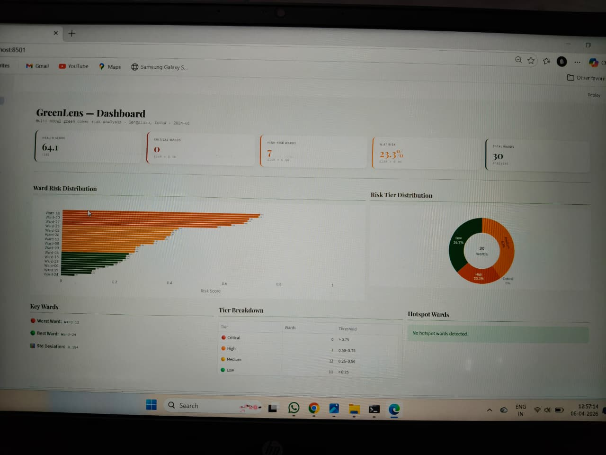
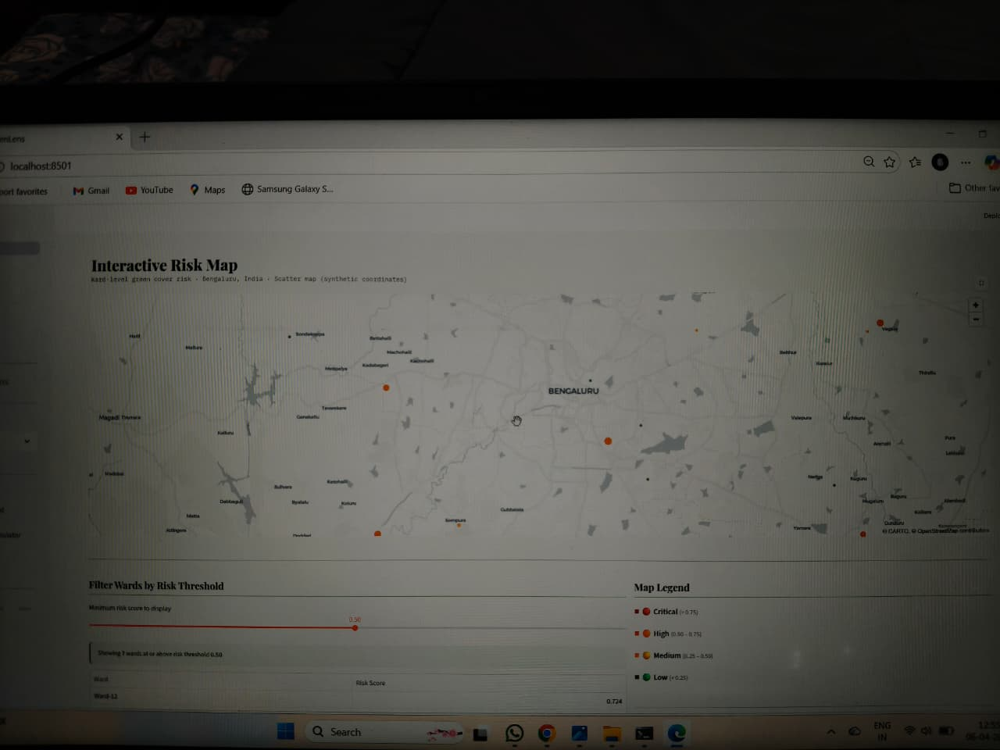
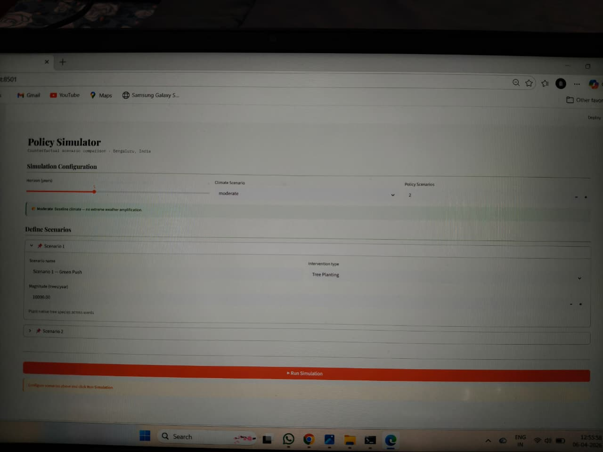

# 🌿 GreenLens

A full-stack Streamlit application for analysing, simulating, and reporting on urban green cover health across city wards.

## Features

| Page | Description |
|------|-------------|
| 📊 Dashboard | City health KPIs, ward risk distribution, colour-coded risk table |
| 🗺️ Risk Map | Interactive scatter map, risk threshold filter |
| 🔬 Policy Simulator | Multi-scenario counterfactual simulation with charts & downloads |
| 📄 Upload Policy | PDF/TXT/CSV document extractor with NLP-based signal detection |
| 📈 Analytics | NDVI trends, heatmap, green cover correlation analysis |
| ⚙️ Settings | City config, data refresh, export preferences |

## 📸 Screenshots

### 📊 Dashboard


### 🗺️ Risk Map


### 🔬 Policy Simulator


## Project Structure

```
urban_green_cover/
├── streamlit_app.py          # Entry point
├── requirements.txt
├── config/
│   ├── __init__.py
│   └── settings.py           # App-wide constants & config
├── data/
│   ├── __init__.py
│   ├── generators.py         # Synthetic data generators
│   └── loaders.py            # File/CSV/API data loaders
├── models/
│   ├── __init__.py
│   ├── risk_model.py         # Ward risk scoring engine
│   ├── simulation.py         # Counterfactual simulation engine
│   └── policy_extractor.py   # NLP policy document extractor
├── pages/
│   ├── __init__.py
│   ├── dashboard.py
│   ├── risk_map.py
│   ├── simulator.py
│   ├── upload.py
│   ├── analytics.py
│   └── settings.py
├── utils/
│   ├── __init__.py
│   ├── styling.py            # CSS injection helpers
│   ├── charts.py             # Chart builders
│   └── exports.py            # JSON/CSV export helpers
└── tests/
    ├── test_risk_model.py
    ├── test_simulation.py
    └── test_extractor.py
```

## Quick Start

```bash
# 1. Clone / download the project
cd urban_green_cover

# 2. Create virtual environment
python -m venv venv
source venv/bin/activate        # Windows: venv\Scripts\activate

# 3. Install dependencies
pip install -r requirements.txt

# 4. Run the app
streamlit run streamlit_app.py
```

## Configuration

Edit `config/settings.py` to change:
- Default city & coordinates
- Number of demo wards
- Risk threshold levels
- Simulation parameters

## Running Tests

```bash
pytest tests/ -v
```

## Requirements

- Python 3.9+
- Streamlit 1.32+
- See `requirements.txt` for full list
